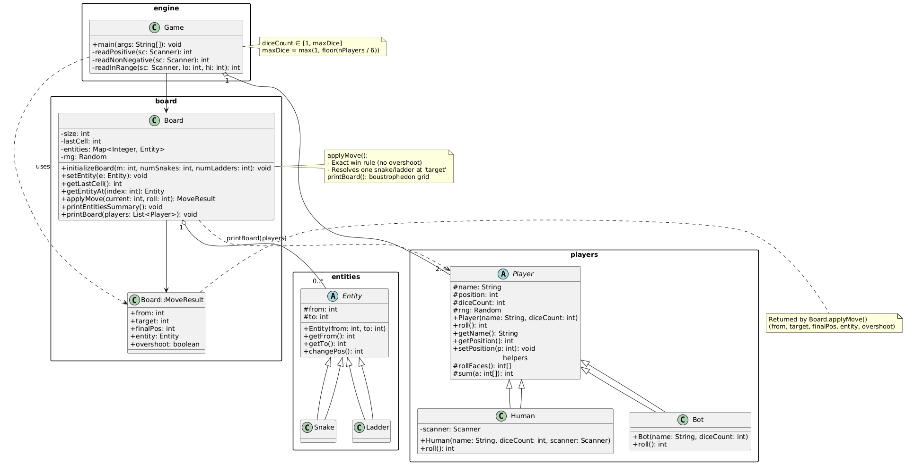

## Snake & Ladder

A minimal console implementation of Snake & Ladder with multiple dice, human/bot players, random snakes & ladders.

### Features

- Any board size m × m

- Any number of players

- Multiple dice (same for all players) with rule:
  - maxDice = max(1, floor(numberOfPlayers / 6))

- Human (H) and Bot (B) players

- Random snakes & ladders (no overlaps; snakes go down, ladders go up)

- Exact-win rule (no overshoot)

- Board printed after every turn

### File Structure
```bash
.
├── Game.java        
├── Board.java       
├── Entity.java      
├── Snake.java       
├── Ladder.java      
├── Player.java      
├── Human.java       
└── Bot.java         
```

### Build and Run

```bash
javac *.java

# run
java Game
```

### How to Play (Input Flow)

At launch, the game asks:

- Board size m (board is m × m)

- Number of players

- Number of dice (must be in [1, maxDice] where maxDice = max(1, floor(players/6)))

- How many snakes?

- How many ladders?

- For each player:

  - Name (optional—defaults to P#)

  - Type: H for Human, B for Bot

- Turn rules

  - Human: press ENTER to roll

  - Bots: roll automatically

- If a player lands on a snake/ladder start, they move to its end

- Exact finish required (no overshoot)

- After each turn, the board is printed

- S marks a snake start, L marks a ladder start

- P1,P2,... show players on that cell

## UML Diagram
